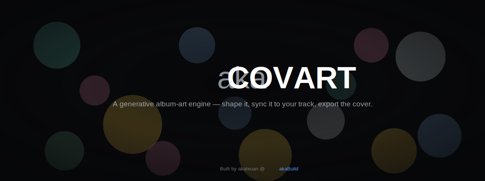
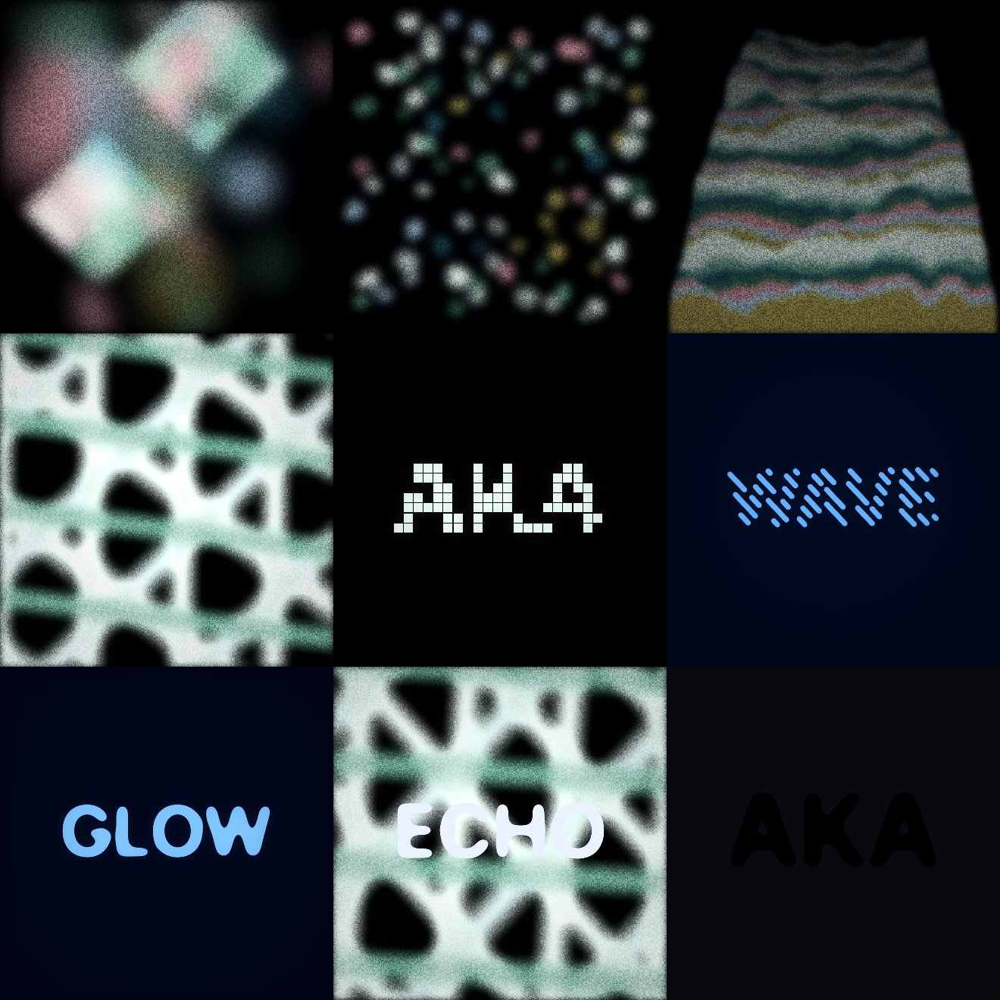

<p align="center">
  
</p>

# akaCOVART — Album Art Engine

> A generative album-art studio: abstract **Art** fields, type-driven **TxT** engines, and a **Stack** mode that composites the two — all deterministic, flicker-free, and exportable as a 3000² PNG or a real, audio-synced MP4.

<p align="center">
  
</p>
<p align="center"><sub>Top: the <b>Art</b> fields (Blob · Grid · Contours · Signal). Middle: the <b>TxT</b> type engines (Dither · Lines · Blur). Bottom: <b>Blur</b> type, a <b>Stack</b> overlay (type on art), and a <b>Stack</b> knockout (art-filled type).</sub></p>

**akaCOVART** is a browser-based studio for generating album art. You pick a **focus** and an **engine**, give it a seed, and shape the result with palettes, composition, film texture, and type — then export a **3000×3000 PNG** or a **looping/track-synced video**. Every image is deterministic: the same seed + parameters always produce the same artwork, so a look you like is reproducible and shareable as data.

It is built for musicians, labels, and designers who want distinctive cover art fast, and for developers who want a clean, framework-agnostic generative engine to build on. Live at **[akacovart.com](https://akacovart.com)**. Built by Ieuan King as a single Next.js + Tailwind app, with the generative core isolated as a pure module under [`src/engine`](./src/engine).

---

## Three focuses

A **focus** decides what the artwork *is*. Switch between them from the header; each filters the engine selector and reshapes the controls.

- **Art** — four abstract field engines: **Blob** (painterly colour clouds), **Grid** (organic cells on a grid), **Contours** (a 3D heightfield terrain of ridgelines), and **Signal** (shimmering moiré interference). The classic generative covers.
- **TxT** — your **display text** *is* the subject, stylised by one of three type engines: **Dither** (pixelated + broken), **Lines** (round-cap hatching clipped to the glyphs), and **Blur** (gooey blur→threshold metaballs). Two-tone colour, smooth and high-res.
- **Stack** — a **TxT type layer composited over an Art background**. Choose **on-top overlay** (ink on the art, with an optional scrim for legibility) or **art-filled knockout** (the art shows *through* the letterforms on a solid bg), and pick which layer animates — **Art**, **Text**, or **Both**.

---

## Highlights

- **Three focuses, seven engines** — 4 Art fields + 3 TxT type engines, plus the Stack compositor — each a self-contained 2D generator with its own composition + motion params.
- **Deterministic, seeded output** — a seeded mulberry32 PRNG means `same seed + same params ⇒ same image`, every time, on every machine.
- **Beat-synced "resolve loop" type animation** — the TxT engines distort the word between beats and **always reform it to the readable still** on the beat, so the type stays recognisable. The whole loop is seamless.
- **Flicker-free motion** — animation moves *space* only (scale, position, displacement, radius) and never brightness, opacity, or hue. The still is always a fixed, baked frame.
- **Palettes, moods & recolour** — three hand-tuned palettes (`dark`, `cream`, `grey`) + a seed-derived `random` mood, a colour picker that shifts the whole palette toward any hue, and a Tone slider that runs it light↔dark. TxT/Stack add direct two-tone background/ink pickers.
- **Multi-format delivery** — engines render square; delivery formats are centre cover-crops, with type drawn in *frame* space so it lands consistently in every aspect ratio.
- **Two motion drivers** — an internal **BPM** clock, or an imported **audio track** (offline FFT + onset analysis → critically-damped springs).
- **Real, valid MP4 export** — PNG at **3000²**; video via a **deterministic WebCodecs H.264 encode** muxed with `mp4-muxer` (moov-at-front, so it opens in QuickTime / Finder / the socials). BPM = a seamless silent loop; **Track = the full clip length with the audio muxed in (AAC)**.
- **Starting points** — a focus-aware grid of curated looks (with live hover previews) on a blank canvas, plus a header "Starts" dropdown and a "Random" tile.
- **Auto mode** — gently auto-evolves a curated set of look params so a frame stays alive without touching the sliders.
- **Responsive** — a desktop sidebar and a mobile bottom-dock share one set of data-driven control sections.
- **Static-export SPA** — ships as a fully static site (`next build` → `out/`), deployable to any static host.
- **Params-as-data & Claude-friendly** — an image is a flat JSON bag of `{ engine, seed, params }`. Two in-repo Claude Code skills scaffold new engines and presets (see [Extending](#extending)).

---

## Quick start

### Prerequisites

- **Node** `22` (see [`.nvmrc`](./.nvmrc))
- **pnpm** (the project ships a `pnpm-lock.yaml`)

```bash
nvm use            # picks up Node 22 from .nvmrc
pnpm install
```

### Develop

```bash
pnpm dev           # http://localhost:3000
```

### Build (static export)

```bash
pnpm build         # static export to ./out
```

[`next.config.ts`](./next.config.ts) sets `output: "export"`, so `pnpm build` emits a self-contained static site in `out/` — no Node server required at runtime.

### Scripts

| Script | Command | What it does |
| --- | --- | --- |
| `pnpm dev` | `next dev` | Dev server at `localhost:3000` |
| `pnpm build` | `next build` | Production build + static export to `out/` |
| `pnpm start` | `next start` | Serve a non-exported production build |
| `pnpm lint` | `next lint` | ESLint over the project |
| `pnpm typecheck` | `tsc --noEmit` | TypeScript type-check, no emit |

---

## Usage walkthrough

1. **Pick a focus + engine.** The header switches **Art / TxT / Stack**; the engine selector then shows that focus's engines (in Stack it picks the Art background, and a Text-layer panel picks the type engine). Composition controls update to match.
2. **Seed & generate.** Type a seed or hit **Generate** for a fresh one. The seed is the single source of truth for the layout — same seed, same image.
3. **Starting points.** A blank canvas opens a focus-aware grid of curated looks (hover a tile on desktop to preview its motion) plus a **Random** tile; re-open it any time from the header **Starts** dropdown.
4. **Look.** Pick `Dark` / `Cream` / `Grey` / `Random`. In Art, push the whole palette toward a colour and run Tone light↔dark; in TxT/Stack, set the **Background** and **Text** tones directly. Atmosphere (Blur, Glow) applies to every engine.
5. **Composition.** Engine-specific controls (blob density, grid columns, terrain ridges, signal layers, dither break, line angle, blur threshold, …) plus a shared **Finish** group (contrast, saturation, vignette).
6. **Texture & type.** Art adds film grain / dust / scratch lines (TxT renders smooth, no grain). Set the **Display text** (TxT/Stack) or the corner **title/artist** overlay (Art) — cover font, case, size, alignment, position.
7. **Mode.** The footer toggles **Still / Animate**:
   - **Still** — one frame. The primary button is **Download PNG · 3000²**.
   - **Animate** — reveals **Beat**, **Drift**, per-engine **Motion**, **Resolve** (TxT loop length), and **Auto**; the button becomes **Export video loop**. Motion is driven by the internal **BPM** clock or an imported **Track**.
8. **Export.**
   - **Still** renders a fresh 3000×3000 canvas offscreen and downloads `albumart_<mood>_<seed>.png` (any delivery format).
   - **Animate** encodes a real `.mp4` with WebCodecs. **BPM** = a short, seamless, silent loop. **Track** = the **full clip window**, motion-synced to the music, with the **audio muxed in**.

---

## Architecture / how it works

### The `src/engine` module boundary

[`src/engine`](./src/engine) is the generative core: **pure, framework-agnostic canvas code** — no React, no Next.js, no store imports. Everything it needs arrives through function arguments, and its only output is pixels on a `CanvasRenderingContext2D`. That boundary lets the same engine power the live preview, the offscreen 3000² export, the per-frame video encode, and the starting-grid thumbnails without modification.

The public surface is re-exported from [`src/engine/index.ts`](./src/engine/index.ts): the types, the engine registry, the PRNG, the palettes, colour helpers, shared params, the finish effects, and the `renderTo` / `renderFormatTo` orchestrators. Importing the module self-registers the built-in engines.

### The `FieldEngine` plugin interface + registry

Every engine implements `FieldEngine` from [`src/engine/types.ts`](./src/engine/types.ts):

```ts
interface FieldEngine {
  id: string;                       // "blob" | "grid" | "contours" | "signal" | "dither" | "lines" | "blur"
  label: string;
  kind: "2d";
  focus?: "art" | "txt";            // which focus this engine belongs to (default "art")
  params: ParamDef[];               // declarative parameter list
  field(args: FieldArgs): void;     // draws the field onto the canvas
}
```

Engines call `registerEngine(...)` at module load and are resolved by id at render time. The selector builds its tabs from `listEnginesByFocus(focus)`, so a newly registered engine appears in the studio automatically ([`src/engine/registry.ts`](./src/engine/registry.ts)).

### Deterministic PRNG

Randomness comes from a seeded mulberry32 generator ([`src/engine/prng.ts`](./src/engine/prng.ts)). The render path **never** calls `Math.random()` — each engine derives independent random streams by XOR-ing the seed with a per-stream constant, e.g. `prng(seed ^ 0x9e3779b1)`. This is the determinism guarantee: **same seed + same params ⇒ identical image** on any device.

### Mood, palettes & recolour

`resolveMood(seed, mood)` ([`src/engine/palettes.ts`](./src/engine/palettes.ts)) returns the concrete `Mood` — when `mood` is `random`, it picks `dark` / `cream` / `grey` deterministically from the seed. The **Colour** controls transform that palette *before* any engine draws (recolour toward a picked hue, then Tone light↔dark), so they affect every engine uniformly; at defaults both steps are no-ops. TxT/Stack resolve a direct two-tone background/ink from the `txtBg` / `txtInk` pickers (or derive them from the mood).

### `renderTo`, formats, and the finish chain

[`src/engine/render.ts`](./src/engine/render.ts) exposes `renderTo(canvas, size, params)` and `renderFormatTo(dest, params)` (a square render cover-cropped into any delivery aspect). `renderTo`:

1. Resolves the seed, mood, palette, and — when animating — builds the eased `AnimState`.
2. Fills the base colour and dispatches to the active engine's `field(...)`. **Stack** focus dispatches the Art engine, runs the finish chain, then composites the TxT layer on top (overlay/scrim or a `destination-in` knockout) — each layer animated per `stackAnim`.
3. Runs the finish chain in a fixed order:

   ```
   soften → scratches → postColor → bloom → vignette → grain → drawText
   ```

   `postColor` is baked on the still and on export, but skipped on live animation frames (applied as a GPU CSS filter instead) so it never strobes. Grain/scratches are skipped for the smooth TxT engines. The chain deliberately **omits** any flicker overlay, strobe, pump-darken, or hue-cycle.

### Beat-synced resolve loop (TxT)

The TxT engines key all motion off a **`loopPhase`** that wraps every *N* beats (the **Resolve** control). A shared envelope holds the word readable for a window, bumps to a distortion peak, then returns to `0` — so the type **melts / scatters / sweeps and reforms to its readable still** every cycle. Because the engines return to the exact still at `loopPhase = 0`, the loop is seamless, which is also what makes the video export loop cleanly.

### UI layer — `src/components` + `src/lib`

The studio UI is a thin React/Next.js layer. State lives in one flat **Zustand** store ([`src/lib/store.ts`](./src/lib/store.ts)) whose keys match exactly what the engine reads. The control panel is **data-driven**: rows are described as data in [`controls-config.ts`](./src/components/controls/controls-config.ts) and rendered by a generic mapper into self-subscribing primitives, so moving one slider re-renders only that row. The same atomic section components feed both the desktop sidebar and the mobile dock. `renderParams(state)` strips the action functions and hands the rest to `renderTo`.

### Export pipeline

[`src/lib/export.ts`](./src/lib/export.ts) renders PNGs offscreen at 3000² via `renderFormatTo`, and encodes video **deterministically** with the WebCodecs `VideoEncoder` (H.264) muxed by [`mp4-muxer`](https://github.com/Vanilagy/mp4-muxer) with moov-at-front, so the `.mp4` opens everywhere. For a **Track**, it renders the full clip frame-by-frame (motion stepped from the analyzed timeline via a shared [`trackMotion`](./src/audio/trackMotion.ts) stepper) and encodes the clip audio to **AAC** alongside the video. A WebM `MediaRecorder` path is the fallback when WebCodecs/H.264 is unavailable.

### Project tree

```
.
├── next.config.ts            # output: "export" (static SPA)
├── scripts/gen-share-assets.mjs  # rasterise /public share PNGs (og/apple/favicon)
├── docs/                     # README assets
└── src
    ├── app/                  # Next.js App Router (layout, page, globals.css)
    ├── audio/                # ── audio-reactive pipeline ──
    │   ├── decode.ts         # MP3/WAV → AudioBuffer + waveform peaks
    │   ├── analyze*.ts       # offline FFT + onset → feature timeline (worker)
    │   ├── features.ts       # AudioFeatures: energy / bass / mid / high / beat
    │   ├── timeline.ts       # sampleByTime(t) with interpolation
    │   ├── transport.ts      # clip play/seek over [clipStart, clipEnd]
    │   └── trackMotion.ts    # deterministic spring stepper (shared by live + export)
    ├── components
    │   ├── canvas/           # CanvasStage (live preview + drag-to-place), autoModulate
    │   ├── controls/         # Controls + controls-config + sections/ + primitives/
    │   ├── studio/           # Studio shell, Header (Focus/Starts), EngineSelector, StartGrid …
    │   └── ui/               # shadcn / base-ui primitives
    ├── lib
    │   ├── export.ts         # PNG (3000²) + WebCodecs MP4 (loop / track+audio)
    │   ├── formats.ts        # delivery aspect ratios
    │   └── store.ts          # Zustand store + defaults + renderParams
    └── engine                # ── framework-agnostic generative core ──
        ├── index.ts          # public API barrel + engine self-register
        ├── types.ts          # FieldEngine, ParamDef, Palette, AnimState …
        ├── registry.ts       # registerEngine / getEngine / listEnginesByFocus
        ├── prng.ts           # seeded mulberry32
        ├── palettes.ts       # palettes + resolveMood + recolour/Tone
        ├── render.ts         # renderTo + renderFormatTo + AnimState builder
        ├── effects/          # the finish chain
        └── engines/          # blob, grid, contours, signal, dither, lines, blur, txtMask
```

---

## Engines

All slider params are `0–100` unless noted. Each engine's full parameter list lives in its own file under [`src/engine/engines`](./src/engine/engines) and in [`controls-config.ts`](./src/components/controls/controls-config.ts).

### Art focus

| Engine | What it draws | Key composition params |
| --- | --- | --- |
| **Blob** | Soft, painterly colour clouds with optional diamond zones + accent streaks | `density`, `smear`, `blobSize`, `glow`, `diamonds`/`diamondCount`/`diamondSize`/`diamondShape`, `accent`/`accentCount` |
| **Grid** | Organic blob-cells on a grid with 3D perspective + a magnet/scatter attractor | `gridCols`, `gridDensity`, `gridPerspective`, `gridMagnet` |
| **Contours** | A 3D heightfield terrain drawn as receding ridgelines with hidden-line occlusion + colour strata | `contourLines`, `contourWeight`, `contourScale`, `contourDetail`, `contourWarp`, `contourRelief`, `contourFill` |
| **Signal** | Overlapping wave gratings whose crests add into shimmering moiré interference | `signalFreq`, `signalLayers`, `signalSpread`, `signalSharp` |

Each has a dedicated, space-only **Motion** set (flow / swirl / pulse / drift / morph / …). Contours and Signal use **noise-driven domain drift + frequency/angle drift**, so the terrain and moiré continuously *reorganise* rather than looping.

### TxT focus

Each renders the shared **display text** (`txtText` / `txtSub`, with the cover font + case + size + alignment) in two-tone colour. Motion is the beat-synced **resolve loop** (held readable on the beat, distorting between).

| Engine | Treatment | Key params |
| --- | --- | --- |
| **Dither** | The word pixelated into a grid of square/round pixels, then *broken* by a hashed dropout | `ditherSize`, `ditherBreak`, `ditherGap`, `ditherRound`, `ditherInvert` · motion: `ditherShuffle`/`ditherJitter`/`ditherPulse`/`ditherSwell` |
| **Lines** | Parallel round-cap strokes clipped to the glyphs into oval segments of varying length | `lineSize`, `lineGap`, `lineAngle`, `lineInvert` · motion: `lineRotate`/`lineScroll`/`linePulse`/`lineWave` |
| **Blur** | Gaussian blur → hard threshold → gooey merged metaball letterforms | `blurAmount`, `blurThreshold`, `blurInvert` · motion: `blurFlow`/`blurPulse`/`blurDrift` |

Shared across all three: **`txtLoopBeats`** (the *Resolve* control — how many beats per reform).

### Stack focus

Reuses the `engine` field for the **Art background** plus `stackTxt` for the overlay type engine, with `stackMode` (**overlay** / **knockout**), `stackScrim` (overlay veil), and `stackAnim` (which layer animates: **art** / **txt** / **both**, default *txt*).

---

## Animate & audio

In **Animate** mode the panel exposes **Beat** (`BPM` 90–160, `Pump`, `Kick`), **Drift** (`Speed`, `Wander`, `Swirl`), the per-engine **Motion** set, **Resolve** (TxT loop length), and **Auto** (a toggle + `Intensity` that wanders a curated set of look params around your sliders — see [`autoModulate.ts`](./src/components/canvas/autoModulate.ts) — without ever writing back to the store).

Set **Source = Track** and import an MP3/WAV to drive motion from the music:

1. **Decode** ([`decode.ts`](./src/audio/decode.ts)) — the file becomes an `AudioBuffer` + waveform peaks.
2. **Analyze** ([`analyze.ts`](./src/audio/analyze.ts) + a worker) — an offline FFT + onset pass turns the chosen clip into a feature timeline: `energy`, `bass`, `mid`, `high`, and a `beat` impulse, all smoothed.
3. **Sample & ease** — the render loop samples the timeline at the transport's current time and runs the features through critically-damped springs, producing the eased `AnimState` the engines consume.
4. **Move** — engines consume `drift` / `swirl` / `kickEnv` / `pumpEnv` / `speed` exactly as in hand-tuned Animate. Audio drives **space only** — contrast / saturation / hue are never modulated by the beat.

Trim the reactive clip (length presets + draggable window) and dial an overall reactivity intensity. The **Export video loop** button then encodes the full clip, motion-synced, with the audio.

---

## Params-as-data (and Claude)

An akaCOVART image is **fully described by data**: an `engine` id, a numeric `seed`, and a flat bag of `params`. `renderParams(state)` in [`src/lib/store.ts`](./src/lib/store.ts) is "the store minus its action functions" — that object is what `renderTo` consumes. Because rendering is deterministic, that small JSON blob *is* the artwork.

That makes the tool naturally LLM-friendly with **zero extra infrastructure**: copy a params object, hand it to Claude, ask it to "make it darker and sparser," and paste the result back. For building *on* akaCOVART with Claude Code, the repo ships dev skills under [`.claude/skills`](./.claude/skills) — **`add-engine`** (scaffolds a new `FieldEngine` + lists every file to wire) and **`add-preset`**.

---

## Extending

### Add an engine

1. Create `src/engine/engines/<your-engine>.ts`, implement `FieldEngine` (an `id`, `label`, `focus`, declarative `params`, and a `field(args)` that draws onto `args.ctx`), and call `registerEngine(...)` at the bottom.
2. Add `import "./<your-engine>";` to [`src/engine/engines/index.ts`](./src/engine/engines/index.ts).
3. Add a default for every new param key to the `defaults` in [`src/lib/store.ts`](./src/lib/store.ts).
4. Add the control rows to `COMPOSITION_BY_ENGINE` (and `MOTION_BY_ENGINE`) in [`controls-config.ts`](./src/components/controls/controls-config.ts), and an icon in [`EngineSelector.tsx`](./src/components/studio/EngineSelector.tsx).

(Working with Claude Code? Run the **`add-engine`** skill, which walks the full checklist.)

### Contribution rules

1. **Deterministic** — derive all randomness from `prng(seed ^ <const>)`, keep the draw order stable, and never call `Math.random()` in the render path. Same seed + params ⇒ same image.
2. **Flicker-free** — no beat/audio-driven brightness, opacity, or hue. Energy (`kickEnv`, `kickSpring`, `pumpEnv`) may only move space (scale, position, displacement, radius). For TxT engines, gate motion by the resolve envelope so the word always returns to its readable still.

---

## Tech stack

| Layer | Choice |
| --- | --- |
| Framework | Next.js (App Router, static export) |
| UI | React 19 |
| Components | shadcn / base-ui |
| Styling | Tailwind CSS v4 |
| State | Zustand |
| Language | TypeScript |
| Generative core | Plain Canvas 2D (no runtime deps) |
| Audio | Web Audio API + offline FFT |
| Video | WebCodecs (H.264 / AAC) + `mp4-muxer` |

---

## Contributing

Contributions are welcome. New engines and presets should follow the two contribution rules above (**deterministic** and **flicker-free**). Keep the [`src/engine`](./src/engine) module free of React and framework imports — it must stay pure canvas code. Run `pnpm typecheck` and `pnpm lint` before opening a PR.

## License

Licensed under [Apache-2.0](./LICENSE).

**Trademark:** "akaCOVART" is a trademark of the project owner and is **not** licensed under Apache-2.0. The source license does not grant rights to use this name, mark, or logos except as required for reasonable and customary use in describing the origin of the work. See [NOTICE](./NOTICE) for details.
