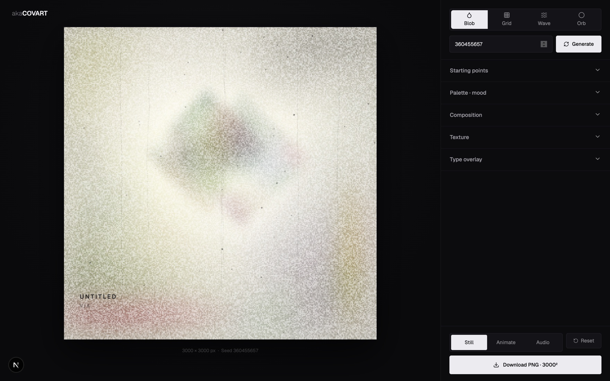
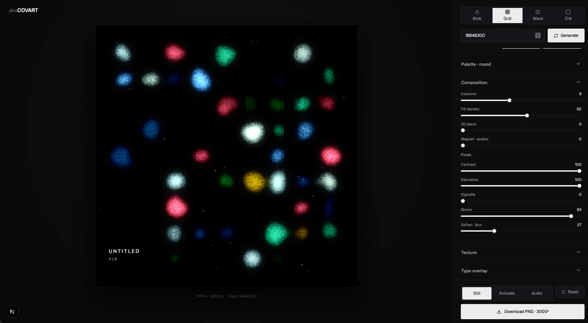
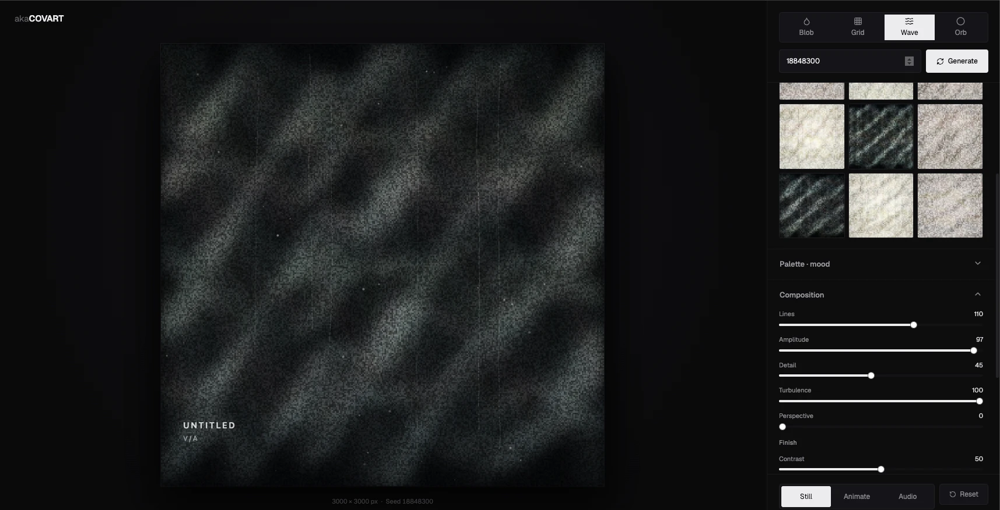
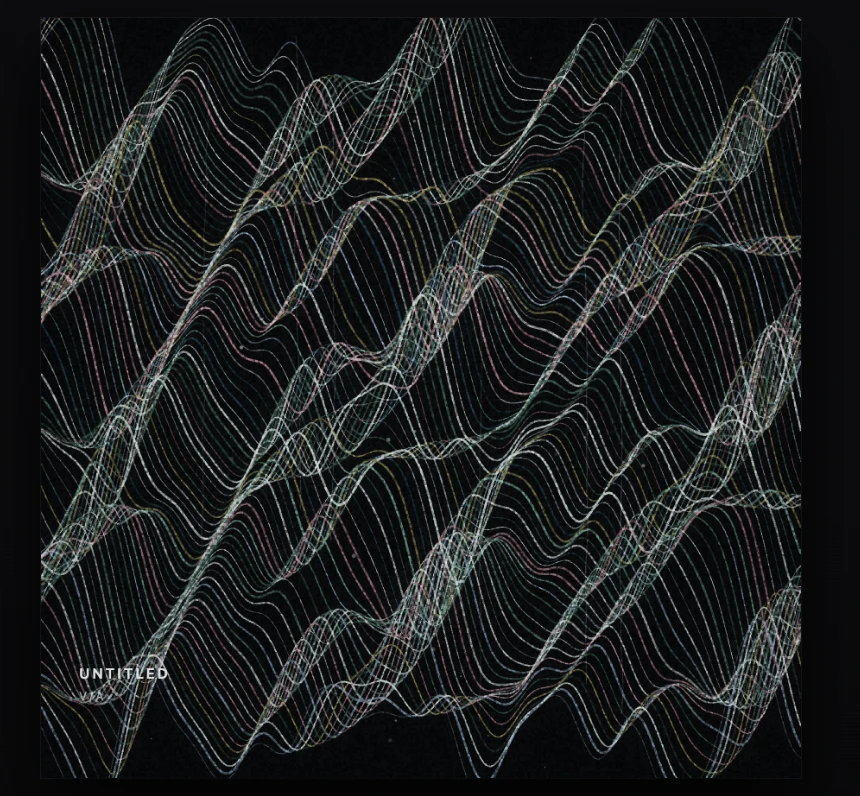
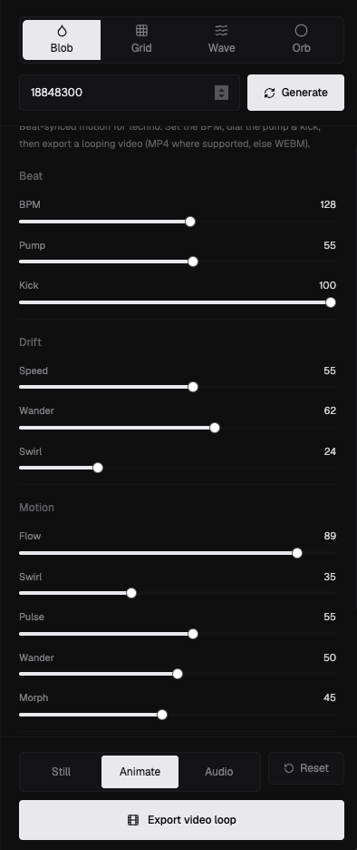
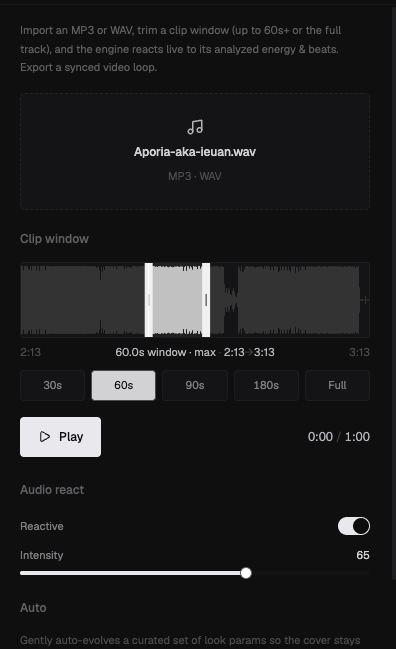

<p align="center">
  
</p>

# akaCOVART — Album Art Engine

> A generative album-art studio built around four deterministic field engines, physical beat- and audio-synced motion, and high-res export.



**akaCOVART** is a browser-based studio for generating album art. You pick a field engine, give it a seed, and shape the result with palettes, composition controls, film texture, and a type overlay — then export a 3000×3000 PNG or a looping video. Every image is deterministic: the same seed and parameters always produce the same artwork, so a result you like is always reproducible and shareable as data.

It is aimed at musicians, labels, and designers who want distinctive cover art fast, and at developers who want a clean, framework-agnostic generative engine to build on. Built by Ieuan King (akaBuild) as a single Next.js + Tailwind app, with the generative core isolated as a pure module under [`src/engine`](./src/engine).

---

## Highlights

- **Four field engines** — **Blob**, **Grid**, **Waves**, and **Contours**, each a self-contained 2D generator with its own composition and motion parameters.
- **Deterministic, seeded output** — a seeded mulberry32 PRNG means `same seed + same params ⇒ same image`, every time, on every machine.
- **Palettes, moods & recolor** — three hand-tuned palettes (`dark`, `cream`, `grey`) plus a seed-derived `random` mood, a color picker that shifts the whole palette toward any hue, and a Tone slider that runs the palette light↔dark.
- **Presets** — eight curated starting points: VOID, RITUAL, ASH, BLEACH, TOXIC, STATIC, OBSIDIAN, HAZE.
- **Variations gallery** — a 9-up grid of seed variations you can reroll and click to adopt.
- **Film finish** — film grain, dust/specks, scratch lines, vignette, bloom, and soften for a printed, physical feel.
- **Type overlay** — title/artist text with a cover-font picker, case modes, a distort/glitch slider, color modes, and drag-to-place positioning on the canvas.
- **Two modes** — **STILL** (a single frame) and **ANIMATE** (beat-synced motion you tune by hand, driven by either the internal BPM clock or an imported audio track).
- **Audio-reactive** — drop in an MP3/WAV, pick a clip, and the engine moves to the music via offline FFT analysis and critically-damped springs.
- **Auto mode** — gently auto-evolves a curated set of look params so a frame stays alive without touching the sliders.
- **High-res PNG export** — renders offscreen at **3000×3000** independent of the on-screen preview size; video loops export via `MediaRecorder` (MP4 where supported, else WEBM).
- **Beat-synced, flicker-free animation** — motion moves *space* only (scale, position, displacement, radius) and never brightness, opacity, or hue.
- **Static-export SPA** — ships as a fully static site (`next build` → `out/`), deployable to any static host.
- **Params-as-data & Claude-friendly** — an image is just a flat JSON bag of `{ engine, seed, params }`, so you can hand a look to an LLM and ask it to nudge it. Two in-repo Claude Code skills scaffold new engines and presets (see [Extending](#extending)).

---

## Looks

The hero above is the **Blob** engine. Here are two more of the four:

<table>
  <tr>
    <td width="50%"></td>
    <td width="50%"></td>
  </tr>
  <tr>
    <td align="center"><sub><b>Grid</b> — organic cells on a grid, recolored + bloomed</sub></td>
    <td align="center"><sub><b>Waves</b> — layered sine lines with film texture</sub></td>
  </tr>
</table>

<p align="center">
  <br>
  <sub>A finished <b>Waves</b> cover (the 3000² canvas, no UI)</sub>
</p>

---

## Quick start

### Prerequisites

- **Node** `22` (see [`.nvmrc`](./.nvmrc))
- **pnpm** (the project ships a `pnpm-lock.yaml`)

```bash
nvm use            # picks up Node 22 from .nvmrc
pnpm install
```

### Develop

```bash
pnpm dev           # http://localhost:3000
```

### Build (static export)

```bash
pnpm build         # static export to ./out
```

[`next.config.ts`](./next.config.ts) sets `output: "export"`, so `pnpm build` emits a self-contained static site in `out/` — no Node server required at runtime.

### Scripts

| Script | Command | What it does |
| --- | --- | --- |
| `pnpm dev` | `next dev` | Dev server at `localhost:3000` |
| `pnpm build` | `next build` | Production build + static export to `out/` |
| `pnpm start` | `next start` | Serve a non-exported production build |
| `pnpm lint` | `next lint` | ESLint over the project |
| `pnpm typecheck` | `tsc --noEmit` | TypeScript type-check, no emit |

---

## Usage walkthrough

1. **Choose an engine.** The selector at the top of the panel switches between **Blob**, **Grid**, **Wave**, and **Orb**. The composition controls below update to match the active engine.
2. **Seed & generate.** Type a seed directly, or hit **Generate** for a fresh random one. The seed is the single source of truth for the random layout — same seed, same image.
3. **Starting points.** This section holds two things: **Presets** — eight one-click looks (mood + composition + finish + texture) — and the **variations gallery**, a 9-up grid rendering the current settings across nine alternate seeds. Click a gallery tile to adopt its seed; reroll for a new set.
4. **Palette · mood.** Pick `Dark`, `Cream`, `Grey`, or `Random` (mood is then derived deterministically from the seed). Use the **Color** picker to push the whole palette toward a chosen color, and the **Tone** slider to run it light↔dark (Tone below 50 darkens the background too).
5. **Composition.** Engine-specific controls (blob density/smear, grid columns, wave amplitude, orb softness, …) plus a shared **Finish** group (contrast, saturation, vignette, bloom, soften).
6. **Texture & type.** Add film grain / dust / scratch lines, then set the title/artist overlay — cover font, case, distort/glitch, color mode, and position. Drag the text directly on the canvas or use the 3×3 position grid.
7. **Pick a mode.** The footer toggles **Still / Animate / Audio**:
   - **Still** — one frame. The primary button is **Download PNG · 3000²**.
   - **Animate** — reveals **Beat**, **Drift**, per-engine **Motion**, and **Auto** controls; the button becomes a video-loop export.
   - **Audio** — opens the audio panel: import a track, trim a clip, and the art reacts; export records the live canvas to video.
8. **Export.**
   - **Still** renders a fresh 3000×3000 canvas offscreen and downloads `albumart_<mood>_<seed>.png`.
   - **Animate / Audio** records the live animated canvas via `MediaRecorder` (MP4 where the browser supports it, otherwise WEBM) and downloads `akacovart_<seed>.<ext>`.

---

## Architecture / how it works

### The `src/engine` module boundary

[`src/engine`](./src/engine) is the generative core. It is **pure, framework-agnostic canvas code** — no React, no Next.js, no store imports. Everything it needs arrives through function arguments, and its only output is pixels drawn onto a `CanvasRenderingContext2D`. This boundary is what lets the same engine power the live preview, the offscreen 3000² export, and the gallery thumbnails without modification.

The module's public surface is re-exported from [`src/engine/index.ts`](./src/engine/index.ts): the type definitions, the engine registry, the PRNG, the palettes, color helpers, shared params, the finish effects, and the `renderTo` orchestrator. Importing the module also self-registers the four built-in engines.

### The `FieldEngine` plugin interface + registry

Every engine implements the `FieldEngine` interface from [`src/engine/types.ts`](./src/engine/types.ts):

```ts
interface FieldEngine {
  id: string;          // "blob" | "grid" | "waves" | "orb"
  label: string;       // human label
  kind: "2d";
  params: ParamDef[];  // declarative parameter list (the in-engine contract)
  field(args: FieldArgs): void; // draws the field onto the canvas
}
```

Engines call `registerEngine(...)` at module load and are looked up by id at render time:

```ts
registerEngine(blob);             // self-registration on import
const engine = getEngine("blob"); // resolved inside renderTo
listEngines();                    // used by the UI to build the engine selector
```

The registry is a simple `Map<string, FieldEngine>` ([`src/engine/registry.ts`](./src/engine/registry.ts)). Because the engine selector builds its tabs from `listEngines()`, a newly registered engine appears in the studio automatically.

### Deterministic PRNG

Randomness comes from a seeded mulberry32 generator ([`src/engine/prng.ts`](./src/engine/prng.ts)). The render path **never** calls `Math.random()` — instead each engine derives independent, named random streams by XOR-ing the seed with a per-stream constant, e.g. `prng(seed ^ 0x9e3779b1)`. The finish effects do the same (`prng(seed ^ 0x2c1b3d77)` for scratches, `prng(seed ^ 0x6d1f2a8b)` for grain, `prng(seed ^ 0x3b9a73c1)` for text). This is the determinism guarantee: **same seed + same params ⇒ identical image**, on any device.

### Mood resolution, palettes & recolor

`resolveMood(seed, mood)` ([`src/engine/palettes.ts`](./src/engine/palettes.ts)) returns the concrete `Mood` — when `mood` is `random`, it picks `dark` / `cream` / `grey` deterministically from the seed, so "random" is still reproducible. Each palette is a rich `Palette` record: base color, color/diamond/accent/marker color sets, fleck and smoke tones, scratch color, and per-mood layout constants (blob count, radius/alpha ranges, diamond alpha, and a couple of compositional flags).

The **Color** controls transform that palette before any engine draws, so they affect every engine uniformly: the resolved mood palette is recolored toward the picked color (`recolorPalette`, if a color is set), then run through `transformPalette` for Tone (light↔dark). At defaults (no picked color, Tone 50) both steps are no-ops and the output is byte-identical to the plain mood palette.

### The `renderTo` orchestrator and finish chain

[`src/engine/render.ts`](./src/engine/render.ts) exposes `renderTo(canvas, size, params)`. It:

1. Resolves the seed, mood, palette (+ recolor/Tone), and — when animating — builds the eased `AnimState`.
2. Fills the base color and dispatches to the active engine's `field(...)`.
3. Runs the **finish chain in a fixed order**:

   ```
   soften → scratches → postColor → bloom → vignette → grain → drawText
   ```

   `postColor` (contrast/saturation) is baked when rendering a still, or when an animation bake/export is requested, but skipped on live animation frames so it never strobes. The chain deliberately **omits** any flicker overlay, strobe, pump-darken, or hue-cycle.

### UI layer — `src/components` + `src/lib`

The studio UI is a thin React/Next.js layer over the engine. State lives in a single flat **Zustand** store ([`src/lib/store.ts`](./src/lib/store.ts)) — a bag of generation params plus UI flags whose keys match exactly what the engine reads. The control panel is **data-driven**: rows are described as data in [`controls-config.ts`](./src/components/controls/controls-config.ts) and rendered by a generic mapper, and each row self-subscribes to its own store slice, so moving one slider re-renders only that row. `renderParams(state)` strips the action functions and hands the rest straight to `renderTo`. [`src/lib/export.ts`](./src/lib/export.ts) handles PNG and video export.

### Project tree

```
.
├── next.config.ts            # output: "export" (static SPA)
├── package.json
├── .nvmrc                    # Node 22
├── LICENSE                   # Apache-2.0
├── NOTICE                    # trademark notice
├── docs/                     # README assets (screenshot)
└── src
    ├── app/                  # Next.js App Router (layout, page, globals.css)
    ├── audio/                # ── audio-reactive pipeline ──
    │   ├── decode.ts         # MP3/WAV → AudioBuffer + waveform peaks
    │   ├── analyze*.ts       # offline FFT + onset → feature timeline (worker)
    │   ├── features.ts       # AudioFeatures: energy / bass / mid / high / beat
    │   ├── fft.ts            # FFT
    │   ├── timeline.ts       # sampleByTime(t) with interpolation
    │   └── transport.ts      # clip play/seek over [clipStart, clipEnd]
    ├── components
    │   ├── canvas/           # Stage, CanvasStage (live preview + drag-to-place), autoModulate
    │   ├── controls/         # Controls, controls-config, Presets, Gallery, primitives/
    │   ├── studio/           # Studio shell, EngineSelector, ModeToggle, Export/Reset, SeedRow, TopBar
    │   └── ui/               # shadcn/base-ui primitives
    ├── lib
    │   ├── export.ts         # PNG (3000²) + video (MediaRecorder)
    │   └── store.ts          # Zustand store + defaults + renderParams
    ├── presets
    │   └── index.ts          # eight curated presets (data only)
    └── engine                # ── framework-agnostic generative core ──
        ├── index.ts          # public API barrel + engine self-register
        ├── types.ts          # FieldEngine, ParamDef, Palette, AnimState …
        ├── registry.ts       # registerEngine / getEngine / listEngines
        ├── prng.ts           # seeded mulberry32
        ├── palettes.ts       # palettes + resolveMood + recolor/Tone
        ├── color.ts          # rgb / rgba helpers
        ├── sharedParams.ts   # mood + finish + texture + type params
        ├── render.ts         # renderTo orchestrator + AnimState builder
        ├── effects/          # the finish chain (soften, scratches, postColor,
        │                     #   bloom, vignette, grain, text)
        └── engines/          # the four field engines (blob, grid, waves, orb)
```

---

## Engines & parameters

All slider/range params are `0–100` unless noted. Defaults below come directly from each engine's `params` definition and the studio control config.

### Blob

Soft, painterly clouds of color with optional "diamond zones" and edge accent streaks, blurred together.

**Composition**

| Key | Label | Type | Default | Description |
| --- | --- | --- | --- | --- |
| `density` | Blob density | range | 60 | How many blobs are painted |
| `smear` | Smear / blur | range | 45 | Overall blur applied to the blob layer |
| `blobSize` | Blob size | range | 50 | Base blob radius scale |
| `glow` | Glow | range | 55 | Blob opacity / luminance factor |
| `diamonds` | Diamond zones | toggle | `true` | Enables clipped diamond-shaped detail zones |
| `diamondCount` | Count | int (0–4) | 2 | Number of diamond zones |
| `diamondSize` | Size | range | 50 | Diamond zone size |
| `diamondShape` | Shape wide–tall | range | 50 | Diamond aspect, wide ↔ tall |
| `accent` | Intensity | range | 60 | Strength of edge accent streaks |
| `accentCount` | Count | int (0–4) | 2 | Number of accent streaks |

**Motion** (animate mode)

| Key | Label | Default | Description |
| --- | --- | --- | --- |
| `blobFlow` | Flow | 55 | Shared curl-like flow field advecting every blob together |
| `blobSwirl` | Swirl | 35 | Slow whole-field rotation around the centre |
| `blobPulse` | Pulse | 55 | Springy, visible beat response on blob radius |
| `blobWander` | Wander | 50 | Per-blob individual roam |
| `blobMorph` | Morph | 45 | Each blob's radius breathes over time |

### Grid

A field of organic blob-cells laid out on a grid, with optional 3D perspective and a magnet/scatter attractor. Motion is a physical, TouchDesigner-style model.

**Composition**

| Key | Label | Type | Default | Description |
| --- | --- | --- | --- | --- |
| `gridCols` | Columns | int (3–18) | 9 | Grid resolution (columns = rows) |
| `gridDensity` | Fill density | range | 55 | Probability each cell is filled |
| `gridPerspective` | 3D plane | range | 0 | Tilts the grid into a receding plane |
| `gridMagnet` | Magnet · scatter | range | 0 | Strength of the attractor pull + scatter |

**Motion** (animate mode)

| Key | Label | Default | Description |
| --- | --- | --- | --- |
| `gridRipple` | Ripple | 45 | Wave propagating outward from centre — displaces cell scale + radial position |
| `gridBob` | Bob | 40 | Per-cell positional oscillation |
| `gridPop` | Pop | 55 | Springy beat scale pop (signed overshoot via `kickSpring`) |
| `gridOrbit` | Orbit | 35 | Magnet attractor orbits the centre; its pull breathes with `pumpEnv` |
| `gridFlow` | Flow | 30 | Directional traveling shear across the field |

### Waves

Stacked line waves built from layered sine components plus a turbulence layer, with optional perspective.

**Composition**

| Key | Label | Type | Default | Description |
| --- | --- | --- | --- | --- |
| `waveCount` | Lines | int (10–160) | 60 | Number of wave lines |
| `waveAmp` | Amplitude | range | 50 | Wave height |
| `waveDetail` | Detail | range | 45 | Spatial frequency of the body waves |
| `waveTurbulence` | Turbulence | range | 25 | Strength of the high-frequency layer |
| `wavePerspective` | Perspective | range | 0 | Foreshortens lines toward the horizon |

**Motion** (animate mode)

| Key | Label | Default | Description |
| --- | --- | --- | --- |
| `waveFlow` | Flow | 50 | Traveling wave — crests scroll horizontally |
| `waveSwell` | Swell | 40 | Slow global amplitude breathing (LFO) |
| `waveSurge` | Surge | 55 | Bouncy beat amplitude pulse via `kickSpring` |
| `waveChurn` | Churn | 40 | Turbulence layer animates faster |
| `waveUndulate` | Undulate | 45 | Vertical baseline cross-drift |

### Orb

A single melted, shaded sphere with a halftone dot field. The halftone is static (no per-frame shimmer); motion moves the orb through space only.

**Composition**

| Key | Label | Type | Default | Description |
| --- | --- | --- | --- | --- |
| `orbSize` | Orb size | range | 55 | Orb radius |
| `orbSoft` | Softness | range | 55 | Edge blur |
| `orbHalftone` | Halftone | range | 40 | Halftone dot coverage |
| `orbMelt` | Melt | range | 30 | Surface warp / drip distortion |
| `orbShade` | 3D shade | range | 55 | Highlight + shadow shading depth |

**Motion** (animate mode)

| Key | Label | Default | Description |
| --- | --- | --- | --- |
| `orbSpin` | Spin | 25 | Slow rotation of the warp phases + halftone sampling |
| `orbWobble` | Wobble | 40 | Jelly surface — LFO + `kickSpring` drive the warp amplitude |
| `orbBounce` | Bounce | 50 | Squash-and-stretch on the kick (stretch X / squash Y) |
| `orbBreath` | Breath | 35 | Radius LFO + `pumpEnv` breathing |
| `orbChurn` | Churn | 45 | Speed of the warp sine terms |

### Shared PALETTE / FINISH / TEXTURE / TYPE params

These apply across all engines (defined in [`src/engine/sharedParams.ts`](./src/engine/sharedParams.ts) and the studio's [`controls-config.ts`](./src/components/controls/controls-config.ts)).

**Palette**

| Key | Label | Type | Default | Options / Description |
| --- | --- | --- | --- | --- |
| `mood` | Mood | select | `random` | `dark`, `cream`, `grey`, `random` |
| `colorPick` | Color | color | `null` | Hex color the whole palette is pushed toward (null = mood palette unchanged) |
| `colorTone` | Tone dark–light | range | 50 | Runs the palette light↔dark; below 50 darkens the background too |

**Finish**

| Key | Label | Type | Default | Description |
| --- | --- | --- | --- | --- |
| `contrast` | Contrast | range | 50 | Post contrast (baked on still/export) |
| `saturation` | Saturation | range | 50 | Post saturation (baked on still/export) |
| `vignette` | Vignette | range | 28 | Edge darkening |
| `bloom` | Bloom | range | 22 | Soft highlight bloom |
| `soften` | Soften · blur | range | 0 | Whole-image soft blur |

**Texture**

| Key | Label | Type | Default | Description |
| --- | --- | --- | --- | --- |
| `grain` | Film grain | range | 60 | Film grain amount |
| `grainSize` | Grain size | range | 50 | Grain particle size |
| `dust` | Dust / specks | range | 18 | Dust specks |
| `scratches` | Scratch lines | toggle | `true` | Enable scratch lines |
| `scratchCount` | Count | int (0–16) | 6 | Number of scratches |

**Type overlay**

| Key | Label | Type | Default | Options / Description |
| --- | --- | --- | --- | --- |
| `showText` | Render text | toggle | `true` | Draw the title/artist overlay |
| `title` | Title | text | `UNTITLED` | Title text |
| `artist` | Artist | text | `V/A` | Artist text |
| `textFont` | Font | select | `Space Grotesk` | `Space Grotesk`, `Anton`, `Instrument Serif`, `Syne` |
| `textCase` | Case | select | `upper` | `upper`, `lower`, `asis` (As-is), `manic` (Manic) |
| `distort` | Distort / glitch | range | 0 | Type glitch / displacement |
| `textColor` | Color | select | `auto` | `auto`, `light`, `dark` |

Text position (`textX`, `textY`, `textAlign`) is set via the 3×3 position grid or by dragging the text directly on the canvas.

---

## Animation system

### No-flicker philosophy

The single hard rule of the animation system: **beat/audio energy drives space only** — scale, position, displacement, and radius — and **never** brightness, opacity, or hue. There is no strobe, no flash, no per-frame hue cycle, no pump-darken. Beats read as physical movement (a pump, a bounce, a ripple), which is comfortable to watch on loop and safe for photosensitive viewers. The `postColor` (contrast/saturation) pass is even skipped on live animation frames and only baked for stills/exports, so color grading can't shimmer.

### Eased `AnimState` primitives

When animating, `buildAnim` in [`src/engine/render.ts`](./src/engine/render.ts) constructs an `AnimState` of eased, continuous values from the BPM and the kick/pump sliders. Engines read these and apply them to geometry:

- **`beat`** — a continuous beat phase in `[0, 1)`, wrapping each beat (`(rt · bpm/60) % 1`).
- **`kickEnv`** — a smooth attack-decay impulse, `kick · (1 − beat)^3.4`. A calm pulse that peaks on the beat and eases out.
- **`kickSpring`** — a **signed** damped bounce, `kick · e^(−3.2·beat) · cos(2π · 1.6 · beat)`. It overshoots then settles, giving springy pops.
- **`pumpEnv`** — a breathing envelope, `pump · (1 − beat)^2.0`.

Alongside these the state carries `drift`, `swirl`, `speed`, and timing (`t`, `rt`). When not animating, every energy term is zero, so the still render is perfectly calm and identical to a baked frame.

### Control groups



In **Animate** mode the panel exposes:

- **Beat** — `BPM` (90–160, default 128), `Pump`, `Kick`. These feed the envelopes above.
- **Drift** — `Speed`, `Wander`, `Swirl`. Slow, continuous, engine-agnostic motion.
- **Motion** — the per-engine physical parameters listed in the engine tables above. Every engine has its own dedicated, space-only motion set.
- **Auto** — a toggle + `Intensity`. Auto-evolves a curated set of look params around your current slider values so the frame stays alive on its own (see [`autoModulate.ts`](./src/components/canvas/autoModulate.ts)). It only wanders around your base — it never writes back to the store.

### Audio reactivity



In **Audio** mode you import an MP3/WAV and the art moves to the track:

1. **Decode** ([`decode.ts`](./src/audio/decode.ts)) — the file becomes an `AudioBuffer` plus waveform peaks for the timeline display.
2. **Analyze** ([`analyze.ts`](./src/audio/analyze.ts) + a worker) — an offline FFT + onset pass turns the chosen clip into a feature timeline: `energy`, `bass`, `mid`, `high`, and a `beat` impulse, all smoothed.
3. **Sample & ease** — the render loop samples the timeline at the transport's current time ([`timeline.ts`](./src/audio/timeline.ts), [`transport.ts`](./src/audio/transport.ts)) and runs the features through critically-damped springs, producing the same eased `AnimState` the manual path uses.
4. **Move** — engines consume `drift` / `swirl` / `kickEnv` / `pumpEnv` / `speed` exactly as in hand-tuned Animate mode. As always, audio drives **space only** — `contrast` / `saturation` / `bloom` are never modulated by the beat.

You can trim the reactive clip (length presets + draggable window) and dial an overall reactivity intensity. Export records the live animated canvas to a video loop.

---

## Params-as-data (and Claude)

An akaCOVART image is **fully described by data**: an `engine` id, a numeric `seed`, and a flat bag of `params` (every slider/toggle/text value). `renderParams(state)` in [`src/lib/store.ts`](./src/lib/store.ts) is literally "the store minus its action functions" — that object is what `renderTo` consumes. Because rendering is deterministic, that small JSON blob *is* the artwork.

This makes the tool naturally LLM-friendly with **zero extra infrastructure**: copy a params object, hand it to Claude (or any model), ask it to "make it darker and sparser," and paste the result back. No API, no plugin — the data is the interface.

For building *on* akaCOVART with Claude Code, the repo ships two small dev skills under [`.claude/skills`](./.claude/skills):

- **`add-engine`** — scaffolds a new `FieldEngine`, encodes the two contribution rules, and lists every file to wire (engine registration, store defaults, control config, selector icon).
- **`add-preset`** — adds a curated preset to [`src/presets/index.ts`](./src/presets/index.ts).

---

## Extending

### Add a preset

Presets are plain data in [`src/presets/index.ts`](./src/presets/index.ts). Add an entry to the `presets` array:

```ts
{
  name: "MY LOOK",
  engine: "blob",           // optional; defaults to the current engine
  params: { mood: "dark", density: 40, glow: 80, grain: 50 /* … */ },
  seed: 12345,              // optional; omit for a random seed on click
}
```

It appears in the **Starting points** panel automatically. A preset only needs to set the params it cares about; everything else stays at the current value. (Working with Claude Code? Run the **`add-preset`** skill.)

### Add an engine

1. Create `src/engine/engines/<your-engine>.ts` and implement the `FieldEngine` interface — an `id`, a `label`, a declarative `params: ParamDef[]`, and a `field(args)` that draws onto `args.ctx`. Call `registerEngine(yourEngine)` at the bottom.
2. Add `import "./<your-engine>";` to [`src/engine/engines/index.ts`](./src/engine/engines/index.ts) so it self-registers.
3. Add a default for every new param key to the `defaults` object in [`src/lib/store.ts`](./src/lib/store.ts).
4. Add the engine's control rows to `COMPOSITION_BY_ENGINE` (and, for animation, `MOTION_BY_ENGINE`) in [`controls-config.ts`](./src/components/controls/controls-config.ts), and optionally an icon in [`EngineSelector.tsx`](./src/components/studio/EngineSelector.tsx).

The engine then shows up as a tab with working controls. (Working with Claude Code? Run the **`add-engine`** skill, which walks the full checklist.)

### Contribution rules

Two rules keep the engine coherent:

1. **Deterministic** — derive all randomness from `prng(seed ^ <const>)`, and keep the draw order stable. Never call `Math.random()` in the render path. Same seed + params must always reproduce the same image.
2. **Flicker-free** — no beat/audio-driven brightness, opacity, or hue. Energy (`kickEnv`, `kickSpring`, `pumpEnv`) may only move space (scale, position, displacement, radius).

---

## Tech stack

| Layer | Choice | Version |
| --- | --- | --- |
| Framework | Next.js (App Router, static export) | `^15.5.4` |
| UI | React | `^19.0.0` |
| Components | shadcn / base-ui | — |
| Styling | Tailwind CSS | `^4.1.16` |
| State | Zustand | `^5.0.8` |
| Language | TypeScript | `^5.9.3` |
| Generative core | Plain Canvas 2D (no runtime deps) | — |
| Audio | Web Audio API + offline FFT | — |

---

## Roadmap

All of the following are **planned**, not yet shipped:

- **Live deploy + shareable permalinks** — a hosted instance plus permalinks that encode `{ engine, seed, params }`, so any image can be reopened and re-edited from a URL (params-as-data, end to end).
- **More field engines** — additional 2D generators built on the `FieldEngine` interface and the `add-engine` skill.
- **Deeper audio mapping** — per-band routing (bass → pulse, highs → swirl, …) and tempo detection so a track drives the look with less manual tuning.

---

## Contributing

Contributions are welcome. New engines and presets should follow the two contribution rules above (**deterministic** and **flicker-free**). Keep the [`src/engine`](./src/engine) module free of React and framework imports — it must stay pure canvas code. Run `pnpm typecheck` and `pnpm lint` before opening a PR.

## License

Licensed under [Apache-2.0](./LICENSE).

**Trademark:** "akaCOVART" is a trademark of the project owner and is **not** licensed under Apache-2.0. The source license does not grant rights to use this name, mark, or logos except as required for reasonable and customary use in describing the origin of the work. See [NOTICE](./NOTICE) for details.
